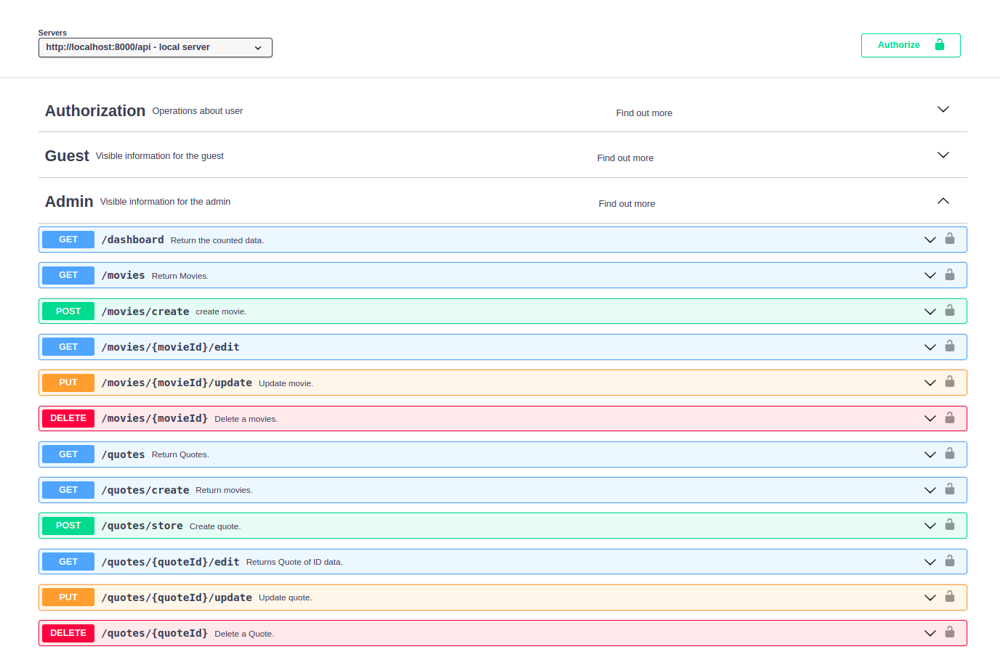
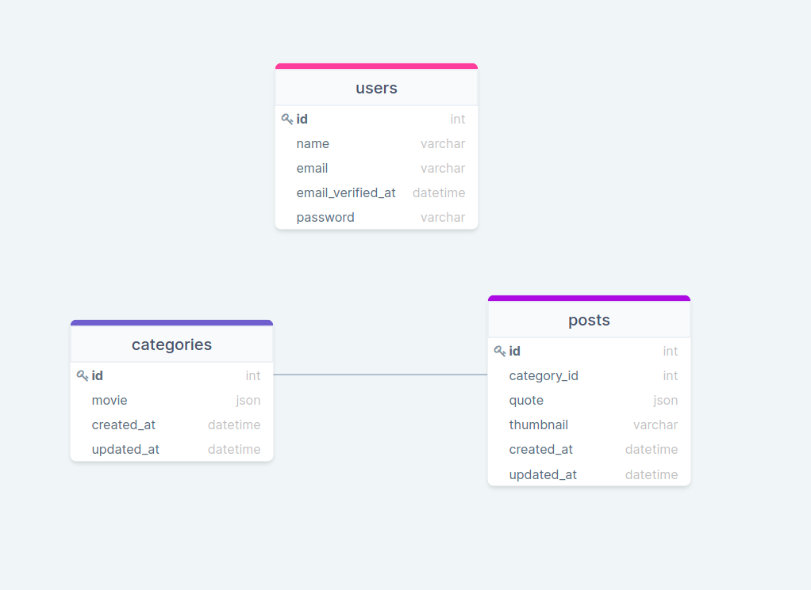

## Table of Contents

* [ Tech Stack](#tech-stack)
* [ Frontend](#frontend)
* [ Prerequisites ](#pre)
* [ Install and Run](#iar)
* [ Package ](#package)
* [ Administrator ](#administrator)
* [ Resources](#resources)

## Frontend
* [React](https://github.com/RedberryInternship/davitlabadze-movie-quotes-front#about-the-application)   
* [Vue](https://github.com/davitlabadze/movie-quotes-vue)
   


## Tech Stack
* [Laravel v8.54](https://laravel.com/docs/8.x)

<a name="pre"></a>

## Prerequisites
### <a  href="https://www.php.net/downloads" target="_blank">version 7.3 and up </a>  
### <a href="https://nodejs.org/en/" target="_blank">  version 14 and up </a> 
### <a href="https://www.mysql.com/downloads/" target="_blank">  version 3 and up </a> 

<a name="package"></a>

## Package
* [Spatie Package](https://github.com/spatie/laravel-translatable)
* [Swagger](https://swagger.io/)
  
  
you can see api routes

```bash 
http://localhost:8000/swagger
```



<a name="iar"></a>

## Install and Run

1. Downoad [ZIP](https://github.com/RedberryInternship/davitlabadze-movie-quotes/archive/refs/heads/main.zip) or 
Clone: 
 ``` 
 git clone https://github.com/davitlabadze/davitlabadze-movie-quotes
```
Install all dependencies using the command
``` 
composer install
```
Create env file Run the command 
```
cp .env.example .env
```
Set the application key 
```
php artisan key:generate
```    
Create a place to store images 
```
php artisan storage:link
```
Create database run the command 
``` 
touch database/database.sqlite 
```
Run the database migrations 
``` 
php artisan migrate
```
Serve the application on the PHP development server
``` 
php artisan serve
```

<a name="administrator"></a>

## Administrator

This artisan command is used to add admin data without registering. 
``` 
php artisan add:admin
``` 


<a name="db"></a>

## Database structure


<a name="resources"></a>

##  Resources
* [DrawSQL](https://drawsql.app/)  


