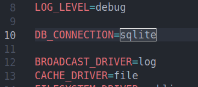
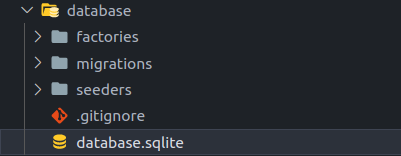
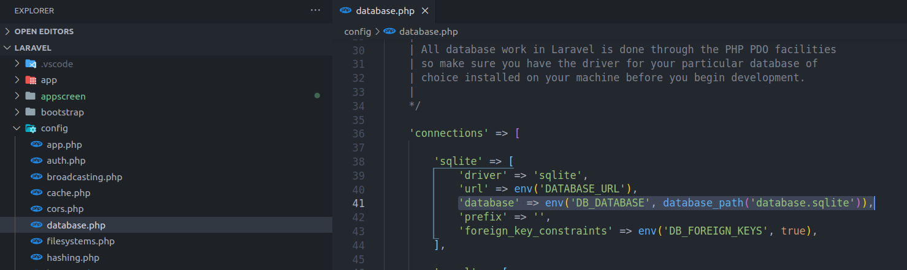

## Table of Contents

*  [ About The App.](#about)
*  [ Prerequisites. ](#pre)
*  [ Install and Run.](#iar)
*  [ Configuring SQLite in Laravel. ](#dbinstall)
*  [ Administrator. ](#administrator)
*  [ Database structure.](#db)
*  [ Resources.](#resources)

<a name="about"></a>

## About the application

Movie Quotes is a website where you can browse the website and view a random movie quote. Also go to the random movie page and see the famous quote from this movie. The website has a multilingual function, these are en and ka.

## App looks like 

---
<a name="pre"></a>

## Prerequisites
### <a  href="https://www.php.net/downloads" target="_blank">version 7.3 and up </a>  
### <a href="https://nodejs.org/en/" target="_blank">  version 14 and up </a> 
### <a href="https://www.mysql.com/downloads/" target="_blank">  version 3 and up </a> 

<a name="iar"></a>

## Install and Run

1. Downoad [ZIP](https://github.com/RedberryInternship/davitlabadze-movie-quotes/archive/refs/heads/main.zip) or Clone: ```https://github.com/RedberryInternship/davitlabadze-movie-quotes.git```
2. Install all dependencies using the ```composer i``` command
3. Install NPM using the ```npm i``` command
4. Run the command ```npm run watch``` or ```npm run dev```
5. Create env file Run the command ```cp .env.example .env```
6. Run  the command ```php artisan key:generate```
7. Enter local instead of public in the ```.env``` file ```FILESYSTEM_DRIVER=public``` .    
8. Create a place to store images ```php artisan storage:link```
9. If you already have a configured database, execute the following commands
10. Run the command  ```php artisan migrate```
11. Run the command  ```php artisan serve```


<a name="dbinstall"></a>

## Configuring SQLite in Laravel
#### About SQLite
One of the drivers of Laravel Eloquent is SQLite, so running SQLite simply means changing the .env file. SQLite does not need a database name, username or password because SQLite is a single file and users and privileges do not exist.

#### Configuration
1. Write ```DB_CONNECTION=sqlite``` and delete the database settings from ```.env```.

    
2. We also need to create a blank file in the database folder named ```database.sqlite``` because Laravel searches for the SQLite file at this address by default:
    > If you use Linux. Go to the directory database `cd database` and run: ```touch database.sqlite```
    Note!: Do not forget to go back to the previous directory. The command `cd ../`
   
   


> If you want SQLite database (file) to another address, then in ```config/database.php``` we need to get the desired address and file name:



<a name="administrator"></a>

## Administrator

> Run command ```php artisan add:admin``` and enter data.

<a name="db"></a>

## Database structure


<a name="resources"></a>
##  Resources
* [Spatie Package](https://github.com/spatie/laravel-translatable)
* [DrawSQL](https://drawsql.app/)   
* [Figma Designs](https://www.figma.com/file/IIJOKK5esgM8uK8pM3D59J/Movie-Quotes?node-id=0%3A1)
* [TailwindCss](https://tailwindcss.com/docs/guides/laravel)
