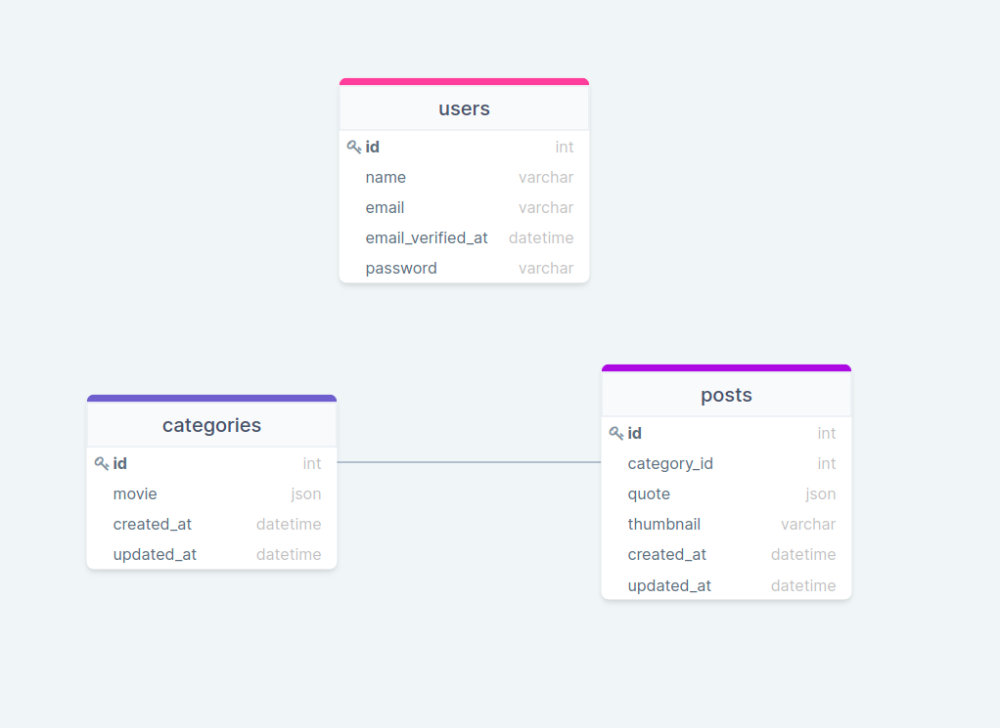

## Table of Contents

* [ Prerequisites ](#pre)
* [ Install and Run](#iar)
* [ Package ](#package)
* [ Administrator ](#administrator)
* [ Resources](#resources)

<a name="pre"></a>

## Prerequisites
### <a  href="https://www.php.net/downloads" target="_blank">version 7.3 and up </a>  
### <a href="https://nodejs.org/en/" target="_blank">  version 14 and up </a> 
### <a href="https://www.mysql.com/downloads/" target="_blank">  version 3 and up </a> 

<a name="package"></a>

## Package
* [Spatie Package](https://github.com/spatie/laravel-translatable)
* [Swagger](https://swagger.io/)
  
  
you can see api routes

```bash 
http://localhost:8000/swagger
```

<a name="iar"></a>

## Install and Run

1. Downoad [ZIP](https://github.com/RedberryInternship/davitlabadze-movie-quotes/archive/refs/heads/main.zip) or 
Clone: 
 ```bash 
 https://github.com/davitlabadze/davitlabadze-movie-quotes
```
Install all dependencies using the command
```bash 
composer install
```
Create env file Run the command 
```bash 
cp .env.example .env
```
Run  the command 
```bash
php artisan key:generate
```    
Create a place to store images 
```bash
php artisan storage:link
```
Create database run the command 
```bash 
touch database/database.sqlite 
```
Run the command  
```bash 
php artisan migrate
```
Run the command  
```bash 
php artisan serve
```

<a name="administrator"></a>

## Administrator

Run command and enter data. 
```bash 
php artisan add:admin
``` 


<a name="db"></a>

## Database structure


<a name="resources"></a>

##  Resources
* [DrawSQL](https://drawsql.app/)  
* [Frontend](https://github.com/RedberryInternship/davitlabadze-movie-quotes-front#about-the-application)   
   


